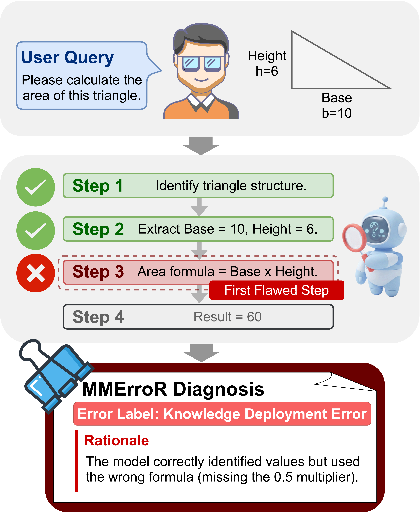

<div align="center">
  <h1>[ACL 2026]  MMErroR: A Benchmark for Erroneous Reasoning in Vision-Language Models</h1>
  <a href="https://mmerror-benchmark.github.io/"></a>
  <a href="https://arxiv.org/abs/2601.03331"></a>
  <a href="https://huggingface.co/datasets/s-u-do/mmerror-benchmark"></a>
</div>

This repository contains the runnable evaluation scripts for the MMErroR benchmark. It is the maintained, config-driven evaluation bundle for the two benchmark tasks:

- `ETC`: Error Type Classification
- `EPD`: Error Presence Detection

MMErroR evaluates whether vision-language models can identify erroneous reasoning, rather than only produce correct answers. In `ETC`, the model is told that an error exists and must classify its type. In `EPD`, the model must first decide whether an error is present and only then diagnose the type if needed.

<div align="center">
  
</div>

## Repository Contents

- `mmerror_eval/`: main config-driven evaluator
- `prompts/`: prompt templates for `ETC` and `EPD`
- `run.py`: primary CLI entrypoint
- `eval_config.yaml`: default evaluation config
- `smoke_test.yaml`: local smoke test config using a mock provider
- `smoke_test_data/`: bundled minimal samples for the local smoke test
- `auto_eval_all_models.py`: batch runner for multiple models and tasks
- `main.sh`: shell wrapper for batch evaluation
- `legacy/`: older evaluation scripts kept for reference

This repository intentionally excludes dataset assets, plotting scripts, paper sources, and historical result files.

## 1. Download and Place the Dataset

The dataset is hosted on Hugging Face:

- <https://huggingface.co/datasets/s-u-do/mmerror-benchmark>

The evaluator needs two folders:

- `data/jsons/`
- `data/images/`

Default layout expected by the example commands below:

```text
<parent-of-this-repo>/
+-- MMerroR-Eval/
`-- data/
    +-- jsons/
    |   +-- MMErroR_00001.json
    |   `-- ...
    `-- images/
        +-- MMErroR_00001.png
        `-- ...
```

If you keep the downloaded Hugging Face snapshot as-is, the dataset layout will be:

```text
mmerror-benchmark/
`-- data/
    +-- jsons/
    `-- images/
```

In that case, pass those exact folders with `--data-dir` and `--image-dir`.

Example download with `huggingface_hub`:

```powershell
python -c "from huggingface_hub import snapshot_download; snapshot_download(repo_id='s-u-do/mmerror-benchmark', repo_type='dataset', local_dir='../mmerror-benchmark')"
```

Then either:

1. Move `..\mmerror-benchmark\data\jsons` and `..\mmerror-benchmark\data\images` to `..\data\jsons` and `..\data\images`, so the default commands work unchanged.
2. Or run the evaluator directly on the downloaded snapshot:

```powershell
python .\run.py --data-dir ..\mmerror-benchmark\data\jsons --image-dir ..\mmerror-benchmark\data\images --task-mode epd
```

## 2. Install Dependencies

```powershell
python -m pip install -r requirements.txt
Copy-Item .\.env.example .\.env
```

Set your API credentials in `.env` or through environment variables:

```powershell
$env:MMERROR_API_BASE="https://your-endpoint/v1/chat/completions"
$env:MMERROR_API_KEY="your-key"
```

## 3. Run the Evaluator

Run a single task with the main config-driven evaluator:

```powershell
python .\run.py --data-dir ..\data\jsons --image-dir ..\data\images --task-mode epd
```

Supported task modes:

- `etc`: Error Type Classification
- `epd`: Error Presence Detection

Useful overrides:

- `--config`: choose a different YAML config
- `--models`: run only selected models from the config
- `--output-dir`: change where reports are written
- `--limit`: evaluate only the first `N` samples
- `--env-file`: load credentials from a specific `.env` file

You can also run the packaged smoke test without any API calls or external dataset download:

```powershell
python .\run.py --config .\smoke_test.yaml
```

## 4. Batch Run ETC and EPD

```powershell
python .\auto_eval_all_models.py ^
  --data-dir ..\data\jsons ^
  --image-dir ..\data\images ^
  --api-base "https://your-endpoint/v1/chat/completions" ^
  --key "your-key" ^
  --models "gpt-5.2,claude-opus-4.5"
```

Or with environment variables:

```powershell
$env:MMERROR_API_BASE="https://your-endpoint/v1/chat/completions"
$env:MMERROR_API_KEY="your-key"
python .\auto_eval_all_models.py --data-dir ..\data\jsons --image-dir ..\data\images
```

For shell environments:

```sh
MMERROR_API_BASE="https://your-endpoint/v1/chat/completions" MMERROR_API_KEY="your-key" sh main.sh
```

`API_BASE` / `API_KEY` are still accepted as compatibility aliases, but `MMERROR_API_BASE` / `MMERROR_API_KEY` are the canonical names.

## 5. Output Structure

- `ETC` results are written to `../result/ETC/`
- `EPD` results are written to `../result/EPD/`
- each model gets a `latest.json` report
- each task also gets `summary.json` and `summary.md`

Use `--output-dir` to override the default result root.

## 6. Notes

- The main evaluator in `mmerror_eval/` is the maintained path.
- The scripts under `legacy/` preserve older behavior and may require more explicit arguments.
- This repository only provides the runnable evaluation code; it does not bundle the dataset itself.

## Citation

If you find MMErroR helpful, please cite:

```bibtex
@misc{shi2026mmerror,
  title={MMErroR: A Benchmark for Erroneous Reasoning in Vision-Language Models},
  author={Yang Shi and Yifeng Xie and Minzhe Guo and Liangsi Lu and Mingxuan Huang and Jingchao Wang and Zhihong Zhu and Boyan Xu and Zhiqi Huang},
  year={2026},
  eprint={2601.03331},
  archivePrefix={arXiv},
  primaryClass={cs.CV},
  url={https://arxiv.org/abs/2601.03331}
}
```
